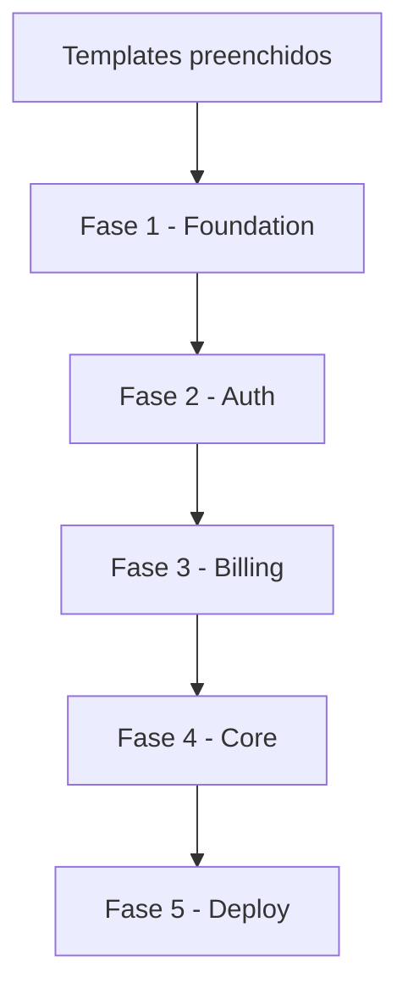

# SaaS AI Framework — Guia para Cursor

Este repositório é um **framework de prompts** para gerar aplicações SaaS com IA. No Cursor, a configuração nativa está em `.cursor/`.

## Início rápido

1. Preencha `templates/project_config.md` e `templates/business_context.md`
2. No chat do Cursor, diga: **"Use a skill project-setup"** (se os templates estiverem vazios)
3. Depois: **"Use a skill saas-orchestrator para iniciar o projeto"**
4. Aprove cada fase antes de avançar

## O que o Cursor carrega automaticamente

### Rules (`.cursor/rules/`)

| Arquivo | Quando aplica |
|---------|---------------|
| `global.mdc` | Sempre — TypeScript, nomenclatura, estrutura |
| `security.mdc` | Sempre — regras de segurança invioláveis |
| `api-design.mdc` | Ao editar `**/api/**` ou `**/actions/**` |
| `database.mdc` | Ao editar `**/prisma/**` ou `*.prisma` |

Fonte original (referência): pasta `rules/`

### Skills (`.cursor/skills/`)

Invoque pelo nome no chat ou pelo seletor de skills:

| Skill | Uso |
|-------|-----|
| `project-setup` | Preencher templates antes de começar |
| `saas-orchestrator` | Orquestrador principal — ponto de entrada |
| `phase-1-foundation` | Infraestrutura base |
| `phase-2-auth-security` | Auth + RBAC |
| `phase-3-billing` | Stripe + planos |
| `architect-agent` | Decisões técnicas e setup |
| `auth-agent` | Login, OAuth, 2FA |
| `security-agent` | RBAC, rate limit, OWASP |
| `database-agent` | Schema, migrations, queries |
| `billing-agent` | Assinaturas e webhooks |
| `frontend-agent` | UI com shadcn/ui |
| `crud-generator` | CRUD completo para uma entidade |
| `stripe` | Padrões Stripe SDK |

Conteúdo detalhado de cada agent: pasta `agents/`, `orchestrators/` e `subagents/`

## Fluxo por fases

| Ordem | Fase | Skill |
|-------|------|-------|
| 1 | Foundation | `phase-1-foundation` |
| 2 | Auth & Security | `phase-2-auth-security` |
| 3 | Billing | `phase-3-billing` |
| 4 | Core Features | ver `orchestrators/PHASE_4_*.md` |
| 5 | Deploy | ver `orchestrators/PHASE_5_*.md` |



**Nunca pule fases.** Cada fase depende da anterior.

## Exemplos de prompts

```
Use a skill saas-orchestrator. Os templates já estão preenchidos.
```

```
Use a skill crud-generator para a entidade Invoice com campos: ...
```

```
Use a skill auth-agent para adicionar login com GitHub OAuth.
```

## Estrutura do repositório

```
saas-ai-framework/
├── .cursor/              ← Configuração nativa do Cursor
│   ├── rules/            ← Regras automáticas (.mdc)
│   └── skills/           ← Skills invocáveis
├── agents/               ← Prompts detalhados dos agents
├── orchestrators/        ← Fases e orquestrador master
├── subagents/            ← Tarefas especializadas (CRUD, etc.)
├── rules/                ← Fonte das rules (espelhada em .cursor/rules/)
├── skills/               ← Fonte das skills de stack (espelhada em .cursor/skills/)
├── templates/            ← Config do projeto e contexto de negócio
└── docs/                 ← Documentação de uso
```

## Documentação

- [HOW_TO_USE.md](docs/HOW_TO_USE.md) — guia completo de uso
- [README.md](README.md) — visão geral do framework
