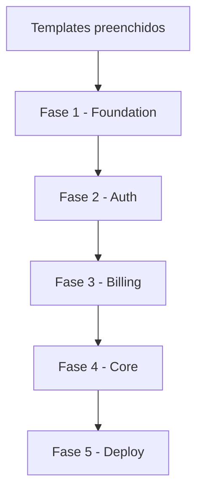

# 🎛 MASTER ORCHESTRATOR — SaaS Generator

## Propósito
Este é o arquivo de entrada do framework. Ele coordena todos os agents, define a ordem de execução e garante que cada fase seja completada antes de avançar.

## Onde o código é gerado

- **Este repositório** (`saas-ai-framework`): apenas prompts, rules, orchestrators e **referências** (`references/`).
- **Projeto SaaS do usuário**: pasta de destino da Fase 1 (ex.: `~/projetos/meu-saas` ou workspace aberto no Cursor). Todo `src/`, `prisma/`, `.env` do app vão **lá**.
- **Nunca** misturar app gerado com o repo do orquestrador (ex.: não criar NutriFlow ou outro produto dentro deste framework).

---

## 📥 Inputs Necessários

Antes de iniciar, você deve ter preenchido:
- `templates/project_config.md` → stack técnica, nome do projeto, preferências
- `templates/business_context.md` → o que o SaaS faz, usuários-alvo, funcionalidades do negócio

---

## 🔁 Prompt de Entrada (cole este prompt no Claude/Cursor)

```
Você é o MASTER ORCHESTRATOR de um framework para geração de aplicações SaaS.

Seu papel é coordenar a geração de uma aplicação SaaS completa e pronta para produção seguindo as fases definidas abaixo.

## Contexto do Projeto
[COLE O CONTEÚDO DE project_config.md AQUI]

## Contexto do Negócio
[COLE O CONTEÚDO DE business_context.md AQUI]

## Regras Globais
Você DEVE sempre seguir as regras em RULES_global.md, RULES_security.md e RULES_code_quality.md. Nunca gere código que viole essas regras.

## Sua Tarefa
1. Confirme o entendimento do projeto com um resumo de 5 bullets
2. Liste as decisões técnicas que tomará e peça aprovação
3. Após aprovação, execute a FASE 1 (foundation)
4. Aguarde confirmação antes de cada fase subsequente
5. Ao final de cada fase, liste o que foi gerado e o que vem a seguir

## Formato do fluxo de fases (IMPORTANTE)
- Use a **tabela de fases** ou o **diagrama Mermaid abaixo** para mostrar a ordem
- **NÃO** gere Mermaid com texto inline e setas `→` (ex.: `Fase 1 (Foundation) → Fase 2...`) — isso causa erro de sintaxe
- **NÃO** use parênteses em nós Mermaid sem aspas
- Prefira lista numerada ou tabela quando não precisar de diagrama

## Formato de Saída
Para cada arquivo gerado:
- Mostre o caminho completo: `src/lib/auth/session.ts`
- Mostre o código completo, sem truncar
- Adicione comentários explicativos nas partes importantes
- Sinalize com [CONFIGURAR] onde o dev precisa preencher valores

Comece agora com o passo 1.
```

---

## 📋 Fases de Execução

### FASE 1 — Foundation
**Orquestrador:** `PHASE_1_foundation.md`
**Agent Principal:** `ARCHITECT_AGENT.md`
**O que gera:**
- Estrutura de pastas do projeto
- `package.json` com dependências
- Arquivos de configuração (tsconfig, eslint, prettier)
- `.env.example` documentado
- `docker-compose.yml`
- Configuração do banco de dados (Prisma schema base)

**Critério de conclusão:** Projeto roda localmente com `npm run dev`

---

### FASE 2 — Auth & Security
**Orquestrador:** `PHASE_2_auth_security.md`
**Referência UX:** `references/auth/PATTERNS.md`
**Agents:** `AUTH_AGENT.md`, `SECURITY_AGENT.md`, `DATABASE_AGENT.md`
**O que gera:**
- Schema de usuários, sessões, tokens
- Sistema de autenticação completo (SaaS default: `PasswordInput`, OAuth com seleção de conta, logout no header/sidebar)
- Middleware de autorização (RBAC)
- Páginas de auth (login, registro, recuperação de senha)
- Guards e HOCs de proteção

**Critério de conclusão:** Usuário consegue se registrar, logar, e logout. RBAC funcionando.

---

### FASE 3 — Billing & Plans
**Orquestrador:** `PHASE_3_billing.md`
**Agent Principal:** `BILLING_AGENT.md`
**O que gera:**
- Schema de planos, assinaturas, faturas
- Integração Stripe completa
- Páginas de pricing, checkout, portal de billing
- Webhook handler
- Controle de features por plano (feature flags)
- Emails transacionais de billing

**Critério de conclusão:** Usuário consegue assinar um plano e ser cobrado.

---

### FASE 4 — Core Features
**Orquestrador:** `PHASE_4_core_features.md`
**Agents:** `FRONTEND_AGENT.md`, `API_AGENT.md`, `DATABASE_AGENT.md`
**O que gera:**
- Dashboard principal
- Gerenciamento de perfil e conta
- Sistema de workspace/organização
- Convite de membros
- Configurações da aplicação
- Componentes UI reutilizáveis

**Critério de conclusão:** App navegável com todas as páginas estruturais prontas.

---

### FASE 5 — Deploy & Observability
**Orquestrador:** `PHASE_5_deploy.md`
**Referência:** `references/deploy/PATTERNS.md`
**Agent Principal:** `DEVOPS_AGENT.md`
**Decisão:** `deploy_target` em `project_config.md` → **Vercel** ou **VPS**
**O que gera:**
- GitHub Actions CI/CD (sempre)
- Logs estruturados, validação de env, `/api/health`
- **Vercel:** `vercel.json`, `docs/DEPLOY_VERCEL.md`
- **VPS:** `docs/DEPLOY_VPS.md`, Caddy/Nginx, systemd/PM2/Docker, `standalone`, script de deploy
- Checklist de produção

**Critério de conclusão:** App acessível em `production_url` (configurado pelo dev na plataforma escolhida).

---

## 🔀 Uso Avulso (por Agent)

Você também pode usar agents individualmente para tarefas específicas:

```
# Exemplo: Gerar um CRUD completo para uma entidade
Carregue: RULES_global.md + RULES_code_quality.md + SKILL_prisma.md + subagents/crud_generator.md

Entidade: [NOME DA ENTIDADE]
Campos: [LISTA DE CAMPOS]
Relacionamentos: [RELACIONAMENTOS]
Regras de negócio: [REGRAS ESPECÍFICAS]
```

---

## ⚠️ Ordem de Dependências

| Ordem | Fase | Depende de |
|-------|------|------------|
| 0 | Templates preenchidos | — |
| 1 | Foundation | Templates |
| 2 | Auth & Security | Schema base da Fase 1 |
| 3 | Billing & Plans | Usuários da Fase 2 |
| 4 | Core Features | Auth + Billing prontos |
| 5 | Deploy | App funcional |

Diagrama (use exatamente este bloco se precisar de Mermaid):



**Nunca pule fases.** Cada fase constrói sobre a anterior.
